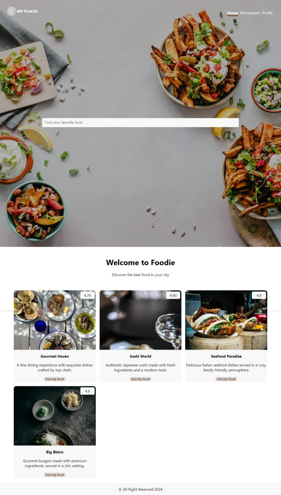

# Foodie
Foodie is a demo project built using the MERN stack (MongoDB, Express.js, React.js, and Node.js). It showcases a restaurant review application where users can view, rate, and review different restaurants.



## Features

- View restaurants
- Rate restaurants
- Write reviews

## References

1. [MERN Stack Overview](https://www.mongodb.com/mern-stack)
2. [React Documentation](https://reactjs.org/docs/getting-started.html)

## Directions to Run the Application

### Prerequisites

Ensure you have installed all necessary dependencies.

### Frontend Setup

1. Navigate to the `frontend` directory and initialize npm:

    ```bash
    cd frontend
    npm init -y
    npm install react-router-dom
    ```
### Backend Setup

2. Navigate to the `backend` directory and install the dependencies:

    ```bash
    cd backend
    npm install express mongoose dotenv cors nodemon
    ```

### Explanation

This setup includes several folders to ensure the Dockerfile runs on the proper port and has the correct entry point.

- **routes**: This folder contains subfolders used to create all the APIs.
- **server.js**: This is the entry point to the backend app. The Dockerfile entry point is now pointed to `server.js`. You can add more APIs through this file. For more information, check `backend/server.js`.

### Environment Variables

Add two `.env` files:

- One in `backend/db/.env`
- Another in `backend/.env`

> **Note**: Ensure these files are present to run the application on the proper port and establish the database connection.
> **Note**: Request the `.env` file to run the application.


### Running the Application with Docker

Run the following Docker Compose commands from the root directory (`StealthProject`):

```bash
docker-compose down
docker-compose build --no-cache
docker-compose up


### Accessing the Application

- **Website**: [http://localhost:3000/](http://localhost:3000/)
- **Backend on Postman**: [http://localhost:5001/](http://localhost:5001/api/...)
>**Note ** Request API Path, or look at the login.js and resturant.js for endpoint
>***Note ** The API Gateway, Login, and Review directories are to provide a loosely coupled application. The directions above uses the Route directory. 

---

Feel free to reach out if you have any questions or run into any issues.